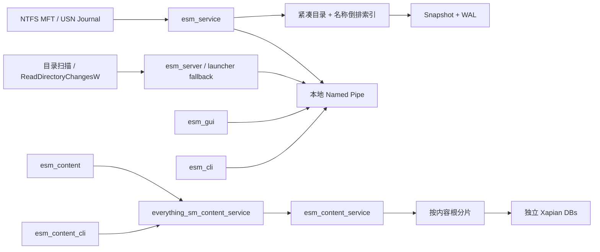

# everything_sm

[](https://github.com/sunfengsheng/esm/actions/workflows/windows-build.yml)


## 文件名搜索与内容搜索分离

本仓库现在明确维护两套隔离链路：

- 文件名搜索：`esm_gui.exe` + `esm_service.exe`，使用 MFT/USN、MetadataIndex、snapshot/WAL；
- 内容搜索：`esm_content.exe` + `esm_content_service.exe` + `esm_content_cli.exe`，使用独立 Xapian 数据库和 `everything_sm_content_service` Pipe。

内容搜索默认把配置和索引放在 `%LOCALAPPDATA%\everything_sm_content`，不会链接进或写入文件名搜索服务。`esm_content.exe` 使用独立图标，提供防抖搜索、状态灯、文件图标、打开/定位/复制路径等操作；除纯文本和源码外，还支持 `.docx`、受限文本型 `.pdf`，以及本机已安装 IFilter 时的旧 `.doc`。扫描版 PDF 仍需要尚未实现的 OCR。GUI 会按需隐藏启动内容服务。独立 NSIS 开发包按用户安装且不需要管理员权限，但在 GPL/source-distribution 审查完成前不得公开分发。详见 [独立内容搜索应用](docs/CONTENT_SEARCH.md)。

`everything_sm` 是一个 clean-room Windows 本地文件搜索引擎，目标是在不复制 Everything 源码的前提下，实现接近 Everything 的文件名搜索体验和性能。

> 当前状态：已实现多卷 NTFS 自动发现、MFT 建库、USN Journal 增量跟踪、快照与 WAL 恢复、Named Pipe 查询服务、Windows SCM 服务、原生 GUI、递归扫描/`ReadDirectoryChangesW` 回退以及 NSIS 安装包；另有与主服务完全隔离的 Xapian 文件内容搜索实验原型。项目仍未达到 Everything 的完整查询语法、完整 NTFS 语义、资源占用和发布成熟度，内容搜索已有独立的每用户开发安装流程，但尚未完成公开发布与许可证审查，详见 [当前状态](docs/CURRENT_STATUS.md)、[内容搜索原型](docs/CONTENT_SEARCH.md) 与 [路线图](docs/ROADMAP.md)。

## 快速开始

### 安装包

1. 运行 `dist\everything_sm-0.1.0-setup.exe`，接受 UAC 管理员权限请求。
2. 保持“安装多卷 NTFS 索引服务”选中。
3. 从桌面或开始菜单启动 `everything_sm`。
4. 在搜索框输入文件名、路径片段或查询表达式。

安装程序默认把程序安装到 `C:\Program Files\everything_sm`，把多卷索引存放到 `C:\ProgramData\everything_sm\indexes`。服务会自动发现带盘符的本地 NTFS 固定卷，包括 `C:`、`D:`、`E:` 等，不只搜索 C 盘。

服务安装时会把发起安装的 Windows 用户 SID 写入 SCM 命令行，查询 Pipe 只允许该用户、SYSTEM 和 Administrators 访问；这适合当前单用户桌面发布，但还不是企业多用户权限隔离。安装器会配置 delayed-auto 和三级故障重启，并注册可读的 Windows Application Event Log source。若服务安装或启动失败，安装器会要求重试或明确继续为“兼容模式”，不会把它描述成完整服务安装成功。

当前正式产物只包含需要 UAC 的 NSIS 安装包和 SHA-256；portable ZIP 已暂停发布，因为现有无服务回退只能配置一个扫描根，不能可靠表达 C/D/E 多卷语义。

详细说明和故障排查见 [用户手册](docs/USER_GUIDE.md)。

### 从源码构建

```powershell
cmake -S . -B build -G "MinGW Makefiles" -DCMAKE_BUILD_TYPE=Release
cmake --build build -j 4
ctest --test-dir build --output-on-failure
```

构建安装包：

```powershell
.\packaging\build-installer.ps1
```

更多构建、测试、基准和提交流程见 [开发指南](docs/DEVELOPMENT.md)。

## 主要程序

| 程序 | 用途 |
|---|---|
| `esm_gui.exe` | 原生桌面搜索窗口 |
| `esm_launcher.exe` | 安装版入口；优先连接服务，必要时启动兼容扫描模式 |
| `esm_service.exe` | Windows SCM 索引服务及服务管理命令 |
| `esm_server.exe` | 前台扫描、MFT 或 live 索引服务器 |
| `esm_cli.exe` | 命令行搜索、诊断和服务查询 |
| `esm_content_service.exe` | 独立 Xapian 文件内容索引服务原型，支持显式固定卷发现和多根分片聚合 |
| `esm_content.exe` | 独立内容搜索 UI，提供连续输入防抖、状态灯、Shell 图标、摘要高亮和结果操作 |
| `esm_content_cli.exe` | 内容服务状态与 IPC 查询诊断 |

内容搜索是显式 opt-in 的实验 target；启用后默认从仓库内 `third_party/xapian-core` 的 Xapian Core 1.4.31 上游源码构建静态库，不依赖预安装的 Xapian 二进制包；详细构建和 GPL 分发边界见 [内容搜索原型](docs/CONTENT_SEARCH.md) 与 [开发指南](docs/DEVELOPMENT.md)。

常用开发命令：

```powershell
# 扫描目录并直接查询
.\build\esm_cli.exe scan D:\ "readme ext:md"

# 启动前台目录扫描服务
.\build\esm_server.exe scan D:\work\everything_sm everything_sm
.\build\esm_cli.exe query everything_sm "readme ext:md"

# 管理默认多卷服务（安装、启动、停止、卸载需要管理员权限）
.\build\esm_service.exe install-mft-auto "C:\ProgramData\everything_sm\indexes" everything_sm_service
.\build\esm_service.exe start
.\build\esm_service.exe status
.\build\esm_service.exe stop
.\build\esm_service.exe uninstall
```

## 查询示例

```text
readme
"annual report"
name:report ext:pdf
path:projects (ext:cpp OR ext:h)
file: size:>10mb dm:>=2026-01-01
attr:hidden !path:cache
dupe:name-size
regex:^report-[0-9]+\.pdf$
```

当前语法是兼容子集，完整说明见 [查询语法](docs/QUERY_SYNTAX.md)。

## 架构概览



详细设计见 [架构文档](docs/ARCHITECTURE.md)。

## 文档

- [文档导航](docs/README.md)
- [用户手册](docs/USER_GUIDE.md)
- [查询语法](docs/QUERY_SYNTAX.md)
- [独立内容搜索原型](docs/CONTENT_SEARCH.md)
- [当前状态](docs/CURRENT_STATUS.md)
- [架构文档](docs/ARCHITECTURE.md)
- [开发指南](docs/DEVELOPMENT.md)
- [运行与维护](docs/OPERATIONS.md)
- [性能说明](docs/PERFORMANCE.md)
- [路线图](docs/ROADMAP.md)
- [贡献指南](CONTRIBUTING.md)
- [变更记录](CHANGELOG.md)

## 文档同步规则

任何源代码、测试、构建、安装、CI、配置或用户可见行为的修改，都必须在同一提交中：

1. 更新 `CHANGELOG.md` 的 `Unreleased`；
2. 更新至少一份对应的长期文档（`README.md`、`CONTRIBUTING.md` 或 `docs/**`）；
3. 运行 `tools/check-docs-updated.ps1`。

仓库提供 Git pre-commit Hook 和 GitHub Actions 检查。安装本地 Hook：

```powershell
.\tools\install-git-hooks.ps1
```

## 项目原则

- 使用公开、文档化的 Windows API 进行 clean-room 实现。
- 优先保证正确性和可测量性能，再进行 UI 打磨。
- 文件名/元数据索引与未来的文档内容索引保持独立。
- 不声称已经完整复刻 Everything，也不声称兼容 Everything ETP。
- [Everything 兼容性矩阵](docs/EVERYTHING_COMPATIBILITY.md)
