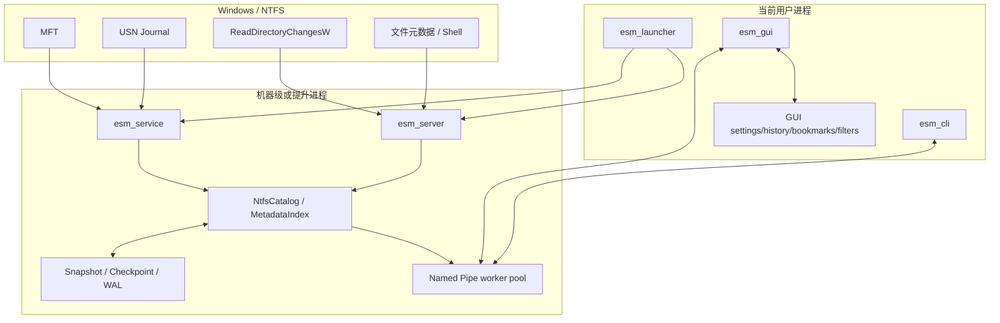
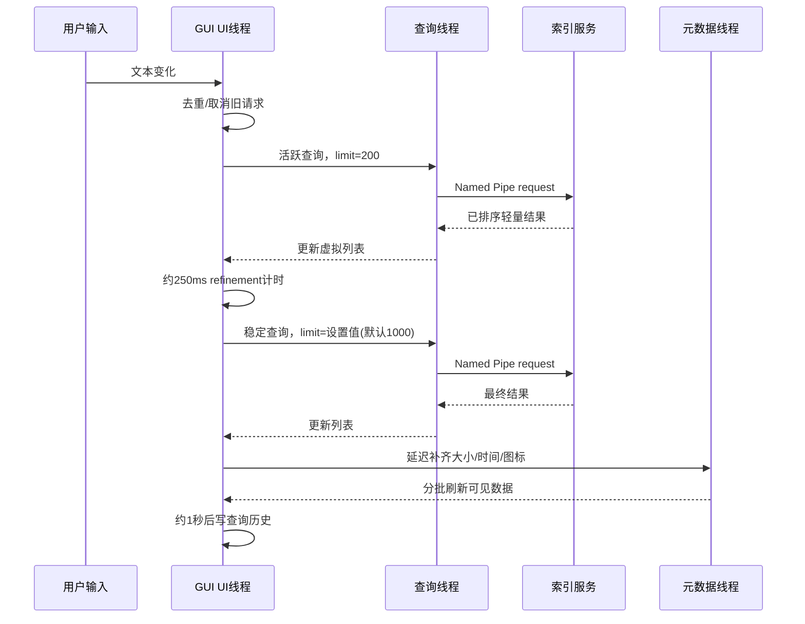

# 架构文档

## 1. 目标与边界

`everything_sm` 是独立 clean-room Windows 文件搜索实现。核心目标：

- 利用 NTFS 元数据快速建立文件名目录；
- 用 USN Journal 增量保持目录新鲜；
- 通过本地服务向低权限 GUI/CLI 提供查询；
- 用快照/WAL 缩短重启并提高崩溃恢复能力；
- 把文件名元数据搜索与未来内容全文索引分离。

当前不实现 Everything ETP，也不把 Everything 私有实现作为代码依赖。

## 2. 进程与组件

### 可执行文件职责

- `esm_service`：SCM 服务宿主及安装/管理命令。
- `esm_server`：前台 `scan`、`mft`、`live` 服务，便于开发和回退。
- `esm_launcher`：安装版入口，优先使用机器服务，失败时启动隐藏扫描服务。
- `esm_gui`：窗口、查询调度、结果展示和文件操作。
- `esm_cli`：查询、扫描、MFT、Journal 和 live 诊断。

## 3. 数据模型与文件身份

`FileRecord` 表示可搜索条目，包含路径、名称、目录标志以及可用的大小、修改时间、属性和 NTFS 身份信息。

NTFS 路径重建以文件引用号和父引用号连接 MFT 节点。多卷模式必须把卷身份加入命名空间，避免不同卷上相同文件引用号冲突。

当前语义边界：

- hard-link 的每个目录入口尚未在所有路径中完整独立表示；
- sequence number 重用、删除后引用复用需要更多边界测试；
- junction、symlink、mount point 和 reparse point 策略仍不完整；
- ADS 不进入当前文件名目录。

## 4. Provider 路径

### 4.1 多卷 NTFS MFT provider

默认安装模式：

1. 枚举带盘符的本地 NTFS 固定卷；
2. 对每个卷读取 MFT；
3. 重建路径并加卷命名空间；
4. 合并进 MetadataIndex；
5. 启动每卷 live 更新；
6. 常规协调约每分钟，完整协调约每 30 分钟；
7. 周期性保存机器级 snapshot。

### 4.2 单卷 live provider

单卷 live 模式使用 checkpoint、metadata snapshot 和 append-only WAL。checkpoint 必须位于不同卷，避免索引自己的持久化写入。

### 4.3 目录扫描 provider

非 NTFS/非提升场景可递归调用 Windows 文件 API 扫描目录。`DirectoryWatcher` 使用 `ReadDirectoryChangesW` 获取变化通知；当前回退策略会在相关变化后协调/重扫目录树，而不是精确维护所有 provider 语义。

## 5. 目录存储

### 5.1 NtfsCatalog

`NtfsCatalog` 使用紧凑基础层保存稳定节点和名称 arena，并用 overlay 表示增量变化。该设计避免每次更新重建完整节点/字符串向量。

v2 snapshot 可 memory-map 到进程地址空间。保存时在共享只读视图下流式写节点和名称 arena，不再先物化百万级 `vector<FileRecord>`。

### 5.2 MetadataIndex

`MetadataIndex` 提供可搜索记录和查询执行。基础层不再为每个条目都保存完整路径：

- 能验证父节点为目录且路径关系一致的普通目录和文件，都只保存名称、`parent_id` 和紧凑元数据；
- 卷根、父记录缺失、父记录不是目录、循环或路径形状不匹配的记录保留完整路径锚点；
- 查询、排序和结果物化时沿最多 512 层父链回溯到完整路径锚点，再顺序拼接目录/文件名；
- 纯名称查询不读取完整路径，只有 `match_path` 或显式 `path:` 条件才执行父链重建；
- 增量 overlay 暂时保留完整 `FileRecord`，compaction 后重新执行路径组件化。

rvalue `replace` 会在紧凑记录和字符串 arena 建好后立即释放源 `vector<FileRecord>`，再构建 posting、Bloom 签名和排序结构，避免百万级源字符串与加速器长期重叠。`CompactRecord` 通过打包目录、路径模式和属性标志保持约 48 字节/记录；名称 bigram Bloom 使用 128 位/记录。

完整路径 Bloom 不再按记录重复保存。每个目录拥有一份 256 位完整目录路径 trigram 签名，每条基础记录保存一个 32 位 `path_signature_owner`：普通文件指向父目录签名，目录指向父目录签名；无法可靠关联父目录的 orphan/异常路径保存独立回退签名。对于不含路径分隔符的 mandatory `path:` 词，候选必须满足“文件名签名可能命中，或父路径签名可能命中”；含 `\`、`/`、`:` 的词跳过共享签名过滤，最终始终由完整 evaluator 校验，避免跨组件 false negative。

名称 trigram posting 使用两遍直接编码：第一遍统计每个 bucket 的 entry 数和 delta/varint 字节数，计算最终 byte offsets；第二遍直接写入最终 `encoded_positions`。构建过程不再保留一份完整的临时 `uint32_t posting_positions`。

默认多卷 `mft-auto` 路径不再长期保留每卷 `NtfsCatalog`：初始 MFT 记录命名空间化后直接构建全局 `MetadataIndex`，后续 `MetadataIndex::apply_ntfs_changes` 直接处理 raw USN create/update/rename/delete，并在目录重命名时刷新受影响后代。单卷 live/snapshot/WAL 路径仍使用 `NtfsCatalog`。当前 snapshot 加载仍先物化完整 `vector<FileRecord>`；UTF-16 arena、构建峰值、紧凑记录布局和搜索结构持久化仍是后续 memory-map/压缩重点。

## 6. 名称 trigram 倒排索引

交互式名称查询使用 `NameTrigramPostingIndex` 缩小候选范围：

- 把名称生成连续 3 字符 gram；
- 每个 gram 计算 16-bit hash，共 65,536 个 bucket；
- posting 按 `natural_name_order` 构建，保存单调递增的自然顺序位置；
- 每个 bucket 使用 `byte_offsets[]`、`counts[]` 和连续 `encoded_positions[]`；
- 相邻自然顺序位置做 unsigned delta，再用 varint 编码；查询只解码被选中的 bucket；
- 同时为 raw 名称和 accent-folded 名称生成 gram；
- 从查询中提取必须出现的名称 trigram，选择最稀疏 posting 作为候选集合；
- 对每个候选运行完整 query evaluator，消除 16-bit hash collision 和复杂语法造成的误报。

无法安全提取 mandatory 名称 gram 的查询（例如部分 `path:`、正则或复杂 OR）会使用更宽的候选路径或完整求值，因此延迟更高。

## 7. 查询引擎

查询解析器：

- token 化普通词、引号、括号和逻辑运算符；
- 用 shunting-yard 风格的优先级处理生成后缀 `QueryInstruction` program；
- 支持隐式 AND；
- `NOT > AND > OR`；
- 把字段、比较符、大小、日期、属性、duplicate mode 和 request flags 写入 `ParsedQuery`。

执行器对每个候选记录运行完整布尔程序。查询语法见 [QUERY_SYNTAX.md](QUERY_SYNTAX.md)。

## 8. 持久化与恢复

### 8.1 Snapshot

metadata snapshot 包含版本、卷/模式标记、记录和校验信息。替换流程：

1. 写入临时文件；
2. 刷新写入；
3. 校验完成；
4. write-through rename 覆盖目标。

如果当前 v2 文件仍被 mapping 使用，Catalog 会先 compact delta 或把不可变基础层物化到自有内存，避免 Windows 因打开 mapping 阻止替换。

### 8.2 WAL

单卷 live 路径把增量变化作为带边界和校验的事务追加到 `<checkpoint>.wal`。启动恢复只重放完整事务，不完整尾部会被截断。checkpoint consolidation 把已确认增量合并回基线。

### 8.3 当前限制

默认多卷 MFT 服务仍使用完整 `mft-index.snapshot`，尚未统一为通用 base snapshot + WAL + delta replay 数据库。多卷服务不再保存每卷 Catalog，也不再每 5 分钟从 Catalog 重新物化完整路径；完整 reconciliation 产生统一记录向量后先写 snapshot，再由 `MetadataIndex` 消费并释放该向量。实时阶段直接把每卷 USN 增量应用到全局索引，因此内存中的搜索结果可实时更新，但磁盘 snapshot 新鲜度仍与完整 reconciliation 周期绑定。

## 9. IPC

Named Pipe 使用项目自有版本化二进制 frame：

- 严格 UTF-8 转换；
- 4 MiB payload 上限；
- 1000 结果上限；
- exact read/write；
- 客户端超时和有限重试；
- `PIPE_REJECT_REMOTE_CLIENTS`；
- 显式 DACL；
- foreground server 与 SCM service 各使用 4 个 worker/pipe instance。

当前服务在 SYSTEM 权限下读取机器目录，但没有为每个查询 impersonate 调用用户，也没有按用户令牌过滤结果。安全边界详见 [OPERATIONS.md](OPERATIONS.md)。

## 10. GUI 查询流水线

关键响应策略：

- 文本变化请求去重和取消过期结果；
- 不重复排序服务端已按名称自然顺序返回的结果；
- Shell 图标按扩展名缓存；
- 文件元数据后台 hydration；
- 搜索历史延迟写入，避免每次按键同步 I/O。

## 11. 设置和用户数据

GUI 设置、历史、书签、筛选器、运行次数/最近打开记录以及自定义 Pipe 均位于 `%LOCALAPPDATA%\everything_sm`。机器 snapshot 位于 `%ProgramData%\everything_sm\indexes`。机器级数据与当前用户偏好分离。

## 12. 并发和一致性

- 服务启动/停止由 SCM 生命周期和 stoppable worker 管理；
- 查询读取稳定索引视图；
- 后台 USN/协调任务更新目录；
- 单卷 Catalog snapshot 可使用独立只读视图流式保存；多卷 snapshot 复用完整 reconciliation 记录，避免额外全量路径副本；
- GUI 用 generation/request 状态丢弃过期响应；
- 元数据和图标后台任务不得直接阻塞 UI 线程。

未来架构修改必须同步更新本文件、`docs/CURRENT_STATUS.md` 和 `CHANGELOG.md`。
