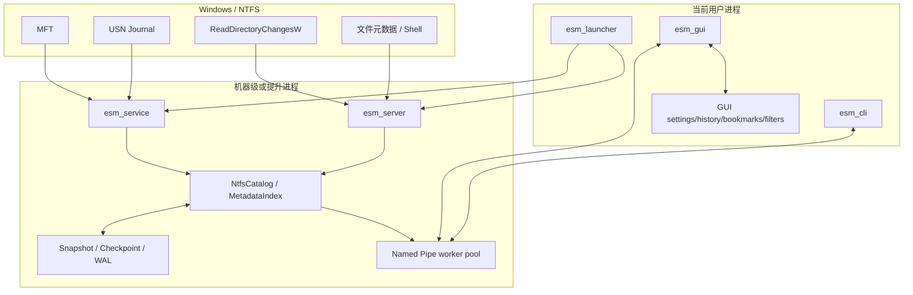
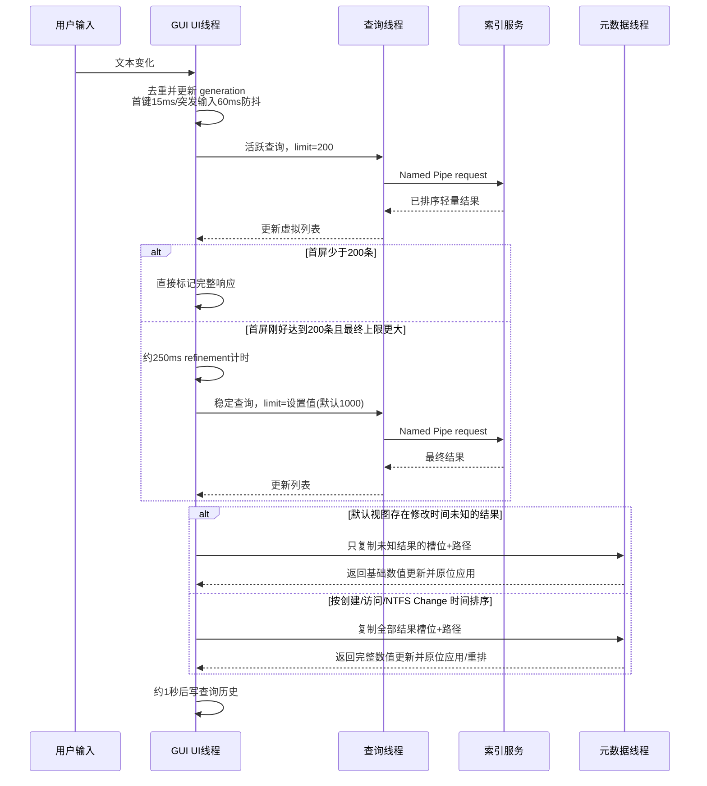
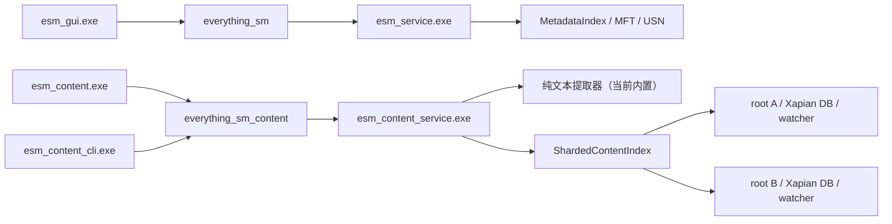
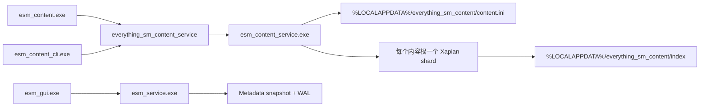
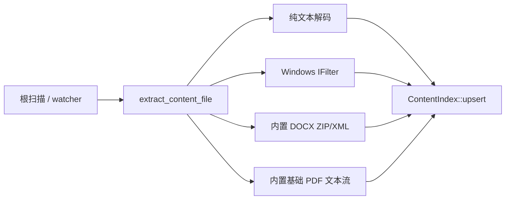
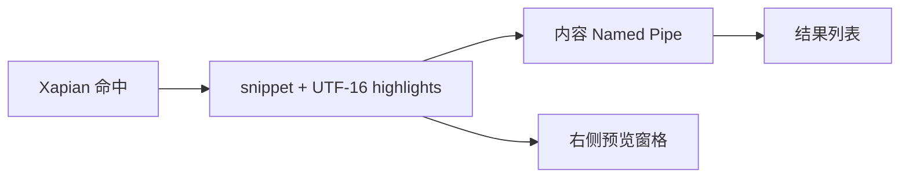

# 架构文档

## 1. 目标与边界

`everything_sm` 是独立 clean-room Windows 文件搜索实现。核心目标：

- 利用 NTFS 元数据快速建立文件名目录；
- 用 USN Journal 增量保持目录新鲜；
- 通过本地服务向低权限 GUI/CLI 提供查询；
- 用快照/WAL 缩短重启并提高崩溃恢复能力；
- 把文件名元数据搜索与未来内容全文索引分离。

当前不实现 Everything ETP，也不把 Everything 私有实现作为代码依赖。

## 2. 进程与组件



### 可执行文件职责

- `esm_service`：SCM 服务宿主及安装/管理命令。
- `esm_server`：前台 `scan`、`mft`、`live` 服务，便于开发和回退。
- `esm_launcher`：安装版入口，优先使用机器服务，失败时启动隐藏扫描服务。
- `esm_gui`：窗口、查询调度、结果展示和文件操作。
- `esm_cli`：查询、扫描、MFT、Journal 和 live 诊断。

## 3. 数据模型与文件身份

`FileRecord` 表示可搜索条目，包含路径、名称、目录标志以及可用的大小、修改时间、属性和 NTFS 身份信息。初始多卷名称基线来自 `FSCTL_ENUM_USN_DATA`，该接口不提供大小和时间；路径重建完成后默认多卷服务先把名称基线写入 snapshot 并发布到 `MetadataIndex`，再从紧凑索引按 ID 有界物化路径、在锁外调用 `GetFileAttributesExW`，逐批合并大小、修改时间、属性和目录状态。CLI、前台 server 和单卷服务仍可在发布前同步补齐。创建时间、访问时间和 NTFS Change 时间仍只在完整单条元数据读取路径中可用，尚未进入紧凑全盘基线。

NTFS 路径重建以文件引用号和父引用号连接 MFT 节点。多卷模式必须把卷身份加入命名空间，避免不同卷上相同文件引用号冲突。

当前语义边界：

- hard-link 的每个目录入口尚未在所有路径中完整独立表示；
- sequence number 重用、删除后引用复用需要更多边界测试；
- junction、symlink、mount point 和 reparse point 策略仍不完整；
- ADS 不进入当前文件名目录。

## 4. Provider 路径

### 4.1 多卷 NTFS MFT provider

默认安装模式：

1. 枚举带盘符的本地 NTFS 固定卷；
2. 对每个卷读取 MFT；
3. 重建路径并加卷命名空间；
4. 完整 reconciliation 仅在当前 live USN 状态仍连续可信时复用元数据：MFT 扫描结束后，先让新旧共有卷的旧 live 状态再次追赶到当前 journal 边界，以覆盖扫描前后尚未轮询的原地内容变化；追赶成功后把新 MFT 记录原地按 ID 排序，并与当前 live base/overlay 线性核对。只有文件 ID、完整路径一致且当前修改时间已知时才复用大小、修改时间和属性。启动 state 失效、扫描后追赶失败、普通 USN 读取失败或 journal gap 会禁用复用，避免旧索引漏掉路径不变的内容修改。随后生成非零 persistence generation，把安全复用后的名称/元数据基线写入机器级 snapshot，并初始化同代 metadata WAL 和多卷状态 sidecar；
5. 发布 `MetadataIndex` 并启动每卷 live 更新，使 Named Pipe 名称查询尽早可用；
6. 协调器先追赶各卷 USN，再从 `MetadataIndex` 按 ID 顺序检查一个 4,096 条基础记录批次；它只物化该批次中未删除且未被 overlay 替代的路径，在索引锁外使用默认最多 4 个 worker 调用文件元数据 API；
7. 元数据读取返回 success bitmap；协调器只为成功项构造 ID、路径 fingerprint、大小、修改时间和属性更新，先以 write-through 事务追加并刷新 metadata WAL，再重新获得索引独占锁；仅在 ID 和完整路径仍匹配时合并内存索引。直接 USN 变化项在文件系统读取前先把旧大小和全部时间字段置为未知，读取失败时不会残留可被查询或跨 generation 复用的 stale 元数据。rename/delete、overlay 替换或完整 reconciliation 产生的过期结果计为 `stale` 并丢弃；
8. 每批之间检查 stop token 和服务停止标志，活动补齐时协调器约等待 10 ms；每检查约 250,000 条写一次 Event Log 进度，完成或停止时写摘要；
9. 约每 250 ms 读取各卷 USN Journal，并约每分钟重新发现挂载卷；USN 本身不携带大小和时间，因此路径解析完成后只对直接创建或发生数据/基础信息变化的条目调用文件元数据读取，目录重命名的未直接变化后代只刷新路径；
10. snapshot 启动时先按 generation 重放 metadata WAL，再加载 sidecar、重新发现卷并验证 identity/root file ID/serial/journal ID 和 snapshot 对应的原始 USN boundary；全部有效时先追赶 USN、从 durable ID 继续补齐并跳过立即完整 reconciliation。状态缺失/损坏、generation 不匹配、卷变化或 journal gap 时保留名称 snapshot 提供查询，同时安排完整 MFT reconciliation；新基线创建新 generation 并重置补齐 cursor。

后台元数据任务不会保留第二份全盘路径列表：每轮最多从紧凑基础层物化 4,096 个未知候选，已经具有非零修改时间的 base 项会跳过。为了避免跨 generation 复用后对大量已知项产生空 WAL flush，一批最多向前检查候选上限的 64 倍，但返回和执行文件 I/O 的未知项仍不超过 4,096 条。内部 worker 仍以 64 条记录为领取批次。单个路径读取失败只增加 `metadata_errors` 并保留原值，不会阻断名称查询。WAL 每个 update 约 40 字节，只保存成功项和事务 cursor；如果 WAL 写入失败，服务记录一次警告并继续本次内存补齐，但该批次不能依赖重启恢复。

### 4.2 单卷 live provider

单卷 live 模式使用 checkpoint、metadata snapshot 和 append-only WAL。checkpoint 必须位于不同卷，避免索引自己的持久化写入。

### 4.3 目录扫描 provider

非 NTFS/非提升场景可递归调用 Windows 文件 API 扫描目录。`DirectoryWatcher` 使用 `ReadDirectoryChangesW` 获取变化通知；当前回退策略会在相关变化后协调/重扫目录树，而不是精确维护所有 provider 语义。

## 5. 目录存储

### 5.1 NtfsCatalog

`NtfsCatalog` 使用紧凑基础层保存稳定节点和名称 arena，并用 overlay 表示增量变化。该设计避免每次更新重建完整节点/字符串向量。

v2 snapshot 可 memory-map 到进程地址空间。保存时在共享只读视图下流式写节点和名称 arena，不再先物化百万级 `vector<FileRecord>`。

### 5.2 MetadataIndex

`MetadataIndex` 提供可搜索记录和查询执行。基础层不再为每个条目都保存完整路径：

- 能验证父节点为目录且路径关系一致的普通目录和文件，都只保存名称、31 位 `parent_index` 和紧凑元数据；
- `parent_index` 直接指向按 ID 排序的基础记录，父链遍历为 O(1)/层；父记录缺失时使用按记录 ID 排序的稀疏 `ParentIdAnchor` 保存原始 64 位父 ID；
- 卷根、父记录缺失、父记录不是目录、循环或路径形状不匹配的记录保留完整路径锚点；
- 查询、排序和结果物化时沿最多 512 层父链回溯到完整路径锚点，再顺序拼接目录/文件名；
- 纯名称查询不读取完整路径，只有 `match_path` 或显式 `path:` 条件才执行父链重建；
- 增量 overlay 暂时保留完整 `FileRecord`，compaction 后重新排序基础记录、重建父索引并执行路径组件化。

rvalue `replace` 会在紧凑记录和字符串 arena 建好后立即释放源 `vector<FileRecord>`，再构建 posting、Bloom 签名和排序结构，避免百万级源字符串与加速器长期重叠。`CompactRecord` 固定为 40 字节：包含 64 位 ID、大小和修改时间，32 位属性和字符串 offset，16 位路径/名称长度，以及打包在 32 位中的 31 位父记录索引和 1 位 name-only 标志。目录状态直接从 Windows 属性位推导；名称 bigram Bloom 使用 128 位/记录。`metadata_hydration_batch(after_id, limit)` 在共享锁下按 ID 有界物化基础记录，并让 cursor 跨过 removed/overlay 项；`apply_search_metadata` 在独占锁下比较 ID 和路径后只更新紧凑搜索字段，从而允许慢文件系统 I/O 完全发生在索引锁外。

完整路径 Bloom 不再按记录重复保存。每个目录拥有一份 256 位完整目录路径 trigram 签名；`directory_signature_bits` 标记目录记录，`directory_signature_rank_prefix` 通过 rank 把目录记录索引映射到签名索引。普通文件直接通过 `parent_index` 推导共享的父目录签名，不再保存每记录 32 位 owner；只有 orphan、父项异常或完整路径不能由父目录加名称表达的文件才保存稀疏 `PathSignatureFallback`。该 owner 元数据从 O(4N) 数组变为 bitset/rank + sparse fallback。对于不含路径分隔符的 mandatory `path:` 词，候选必须满足“文件名签名可能命中，或共享路径签名可能命中”；含 `\`、`/`、`:` 的词跳过共享签名过滤，最终始终由完整 evaluator 校验，避免跨组件 false negative。

`child:`、`empty:`、`childcount:`、`childfilecount:` 和 `childfoldercount:` 使用同一父关系视图。查询解析器发现这些目标后，执行器才为基础目录按 `directory_signature_bits`/rank 分配紧凑的直接文件数、目录数和按 `child:` 查询项分配的命中字节数组，并把未被 suppression 覆盖的 base 子项与实时 overlay 子项合并；overlay 目录只在稀疏哈希表中保存计数或命中标记。`child:` 对每个直接子文件/子目录的名称执行普通子串、通配符或现有大小写/全字规则，不递归检查后代。普通名称、路径、大小和日期查询不会构建这些临时结构。这样保证增量创建、删除和父目录变化能立即反映到子名称、空目录和子项数量语义，同时避免给每个常驻 `CompactRecord` 增加字段；代价是超大目录树上的直接子项查询当前仍需一次 O(N) 父关系遍历，多个 `child:` 条件还会增加 O(N×T) 名称判断，后续若加入常驻 sidecar 必须重新评估内存预算和增量一致性。

名称 trigram posting 使用两遍直接编码：第一遍统计每个 bucket 的 entry 数和 delta/varint 字节数，计算最终 byte offsets；第二遍直接写入最终 `encoded_positions`。构建过程不再保留一份完整的临时 `uint32_t posting_positions`。

默认多卷 `mft-auto` 路径不再长期保留每卷 `NtfsCatalog`：初始 MFT 记录命名空间化后直接构建全局 `MetadataIndex`，后续 `MetadataIndex::apply_ntfs_changes` 直接处理 raw USN create/update/rename/delete，并在目录重命名时刷新受影响后代。单卷 live/snapshot/WAL 路径仍使用 `NtfsCatalog`。当前 snapshot 加载仍先物化完整 `vector<FileRecord>`；UTF-16 arena、约 2.30 GiB 构建峰值、排序索引和搜索结构持久化仍是后续 memory-map/压缩重点。

多卷全量 reconciliation 并行枚举各卷，但不再把结果逐卷直接追加到未预留容量的总 vector。协调器先持有已完成的每卷结果，求和得到最终记录数，对统一 `vector<FileRecord>` 一次性 `reserve`，再移动合并，并在每卷 move-insert 后立即释放源记录 buffer。2026-07-25 的长期服务复测进一步确认：即使调用 `_heapmin`/`HeapCompact`，每 30 分钟重建时产生的数百万独立路径字符串和新旧索引重叠仍会让 CRT heap 保留约一代索引容量。默认多卷服务因此改为 USN 驱动、异常触发完整修复，不再按固定 30 分钟无条件替换整个索引；完整修复后仍执行堆整理，但不使用 Working Set trim。

## 6. 名称 trigram 倒排索引

交互式名称查询使用 `NameTrigramPostingIndex` 缩小候选范围：

- 把名称生成连续 3 字符 gram；
- 每个 gram 计算 16-bit hash，共 65,536 个 bucket；
- posting 按 `natural_name_order` 构建，保存单调递增的自然顺序位置；
- 每个 bucket 使用 `byte_offsets[]`、`counts[]` 和连续 `encoded_positions[]`；
- 相邻自然顺序位置做 unsigned delta，再用 varint 编码；查询只解码被选中的 bucket；
- 同时为 raw 名称和 accent-folded 名称生成 gram；
- 从查询中提取必须出现的名称 trigram，选择最稀疏 posting 作为候选集合；
- 对每个候选运行完整 query evaluator，消除 16-bit hash collision 和复杂语法造成的误报。


无法安全提取 mandatory 名称 gram 的查询（例如部分 `path:`、正则或复杂 OR）会使用更宽的候选路径或完整求值，因此延迟更高。

### 精确 `filelist:` 候选生成

单一正向、非正则且不含 `*`/`?` 的 `filelist:` 不再默认遍历整个 base。执行器从每个列表项提取 basename，通过 `name_prefix_order`/`name_prefix_ranges` 及 accent-folded 对应表定位首字符或前两个字符范围，再用完整文件名比较过滤。只有 basename 精确匹配的记录才重建完整路径并运行原布尔 evaluator；因此路径归一化、大小写、变音符号和其他 request 选项仍由统一语义层决定。查询期 `uint32` 集合只用于去重 raw/folded 和多列表项候选，生命周期限于本次请求，不增加常驻索引。overlay 仍逐项检查；若列表项无法安全提取 basename，或查询包含通配符/复杂程序，则回退原完整候选路径。


## 7. 查询引擎

查询解析器：

- token 化普通词、引号、括号和逻辑运算符；
- 用 shunting-yard 风格的优先级处理生成后缀 `QueryInstruction` program；
- 支持隐式 AND；
- `NOT > AND > OR`；
- 把字段、比较符、大小、日期、属性、duplicate mode 和 request flags 写入 `ParsedQuery`。

执行器对每个候选记录运行完整布尔程序。查询语法见 [QUERY_SYNTAX.md](QUERY_SYNTAX.md)。

## 8. 持久化与恢复

### 8.1 Snapshot

metadata snapshot 包含版本、卷/模式标记、记录和校验信息。替换流程：

1. 写入临时文件；
2. 刷新写入；
3. 校验完成；
4. write-through rename 覆盖目标。

如果当前 v2 文件仍被 mapping 使用，Catalog 会先 compact delta 或把不可变基础层物化到自有内存，避免 Windows 因打开 mapping 阻止替换。

### 8.2 WAL 与多卷状态 sidecar

单卷 live 路径把增量变化作为带边界和校验的事务追加到 `<checkpoint>.wal`。启动恢复只重放完整事务，不完整尾部会被截断。checkpoint consolidation 把已确认增量合并回基线。

多卷 `mft-auto` 使用三个同代文件：`mft-index.snapshot`、`mft-index.snapshot.metadata.wal` 和 `mft-index.snapshot.state`。snapshot checkpoint 字段携带非零 generation；metadata WAL 文件头必须与它匹配。每个事务包含成功读取的元数据 update、`after_id`、`next_id`、检查数、完成标志和校验和，并在内存合并前执行 write-through append + flush。恢复按 ID 线性应用 update，重新计算当前路径 fingerprint，缺失 ID 或路径不匹配记为 stale；不完整尾部会截断。state sidecar 通过临时文件原子替换并校验整文件，保存同一 generation 以及每卷 identity、root file ID、journal ID、snapshot 原始 USN cursor 和 live 标志。恢复时会重新打开当前卷根目录读取 root file ID；读取失败或与 sidecar 不一致都会使该状态失效并触发完整 reconciliation。

恢复时不能用运行期已推进但未持久化名称 delta 的 USN cursor 改写 snapshot boundary，否则重启会错误跳过只存在于内存的名称变化。因此 sidecar 保存的是与名称 snapshot 同一边界的 cursor；启动验证通过后仍先从该边界追赶 USN，再从 metadata WAL 的 durable ID 继续补齐。

### 8.3 当前限制

默认多卷 MFT 服务仍未统一为通用 base snapshot + 名称/USN delta WAL + checkpoint consolidation 数据库。实时阶段直接把每卷 USN 增量应用到全局索引，磁盘名称 snapshot 新鲜度仍与完整 reconciliation 绑定。metadata WAL 只持久化大小、修改时间、属性和补齐 cursor；完整 reconciliation 在 live USN 连续可信时会把当前 live view 中 ID/路径一致且修改时间已知的元数据迁移到新 generation；启动 state 失效、USN 失败或 journal gap 时会禁用迁移。名称/USN delta、旧路径不一致项和未知元数据仍不能跨基线复用。

## 9. IPC

Named Pipe 使用项目自有版本化二进制 frame：

- 严格 UTF-8 转换；
- 4 MiB payload 上限；
- 1000 结果上限；
- exact read/write；
- 客户端连接阶段超时和有限重试；
- `PIPE_REJECT_REMOTE_CLIENTS`；
- 显式 DACL：SYSTEM/Administrators 完全控制，前台 server 使用当前进程 token 用户 SID，SCM service 使用安装时持久化到 ImagePath 的用户 SID；Pipe host 在启动 worker 前一次性解析 SID/SDDL，无效配置直接返回错误，不进入 worker 重试循环；不再授予通用 `Authenticated Users`；
- foreground server 与 SCM service 各使用 4 个 worker/pipe instance。
- `IpcSearchResponse::elapsed_microseconds` 继续只表示 `MetadataIndex::search` 时间，wire format 保持 IPC v1；
- 每个 worker 在协议外生成 `PipeSearchDiagnostics`，分别测量 frame 读取、请求解码、索引搜索、响应编码、写回/flush 和连接后总耗时；observer 异常会被隔离，不能使查询失败；
- SCM service 仅对 `error=ERROR_SUCCESS` 且总耗时不少于 100 ms 的请求写 Event Log，并限制为最多每 5 秒一条、在下一条中附带 `suppressed_since_last`；结构不包含原始 query，只记录字符数、flags、sort、limit 和结果数，避免把文件名或路径泄漏到日志。

当前服务在 SYSTEM 权限下读取机器目录。Pipe 建立阶段只允许安装用户 SID、SYSTEM 和 Administrators 连接，但请求执行时仍没有 impersonate 调用用户，也没有按用户令牌过滤目录项；因此这是单用户连接边界，不是文件 ACL 安全裁决。安全边界详见 [OPERATIONS.md](OPERATIONS.md)。

服务安装把 Event Log message source、automatic/delayed start、服务 SID 和三级 SCM failure actions 视为同一受控创建流程；任一关键配置失败都会删除新建服务和 Event source。删除路径在关闭自身 service handle 后轮询 SCM，直到服务真实消失或超时，避免升级重装撞上 `ERROR_SERVICE_MARKED_FOR_DELETE`。运行时先向 SCM 注册 control handler，再校验持久化的 ImagePath 参数和用户 SID；旧配置缺参数时以明确 Win32 错误进入 `SERVICE_STOPPED` 并写 Event Log，而不是在 `StartServiceCtrlDispatcher` 之前退出造成 1053。运行时事件统一使用二进制内嵌 message table 的事件 ID `0x1000`，避免 Event Viewer 只显示空消息。

当前同步取消边界：`query_named_pipe_search(..., timeout_ms)` 的超时参数只约束连接 Pipe 的等待。连接建立后，frame 读写和 `MetadataIndex::search` 仍是同步调用；客户端关闭、GUI generation 过期或客户端线程返回都不能让已经进入 evaluator 的服务端查询立即停止。GUI 保持最多一个查询在途并丢弃旧 generation 响应，避免每次按键触发取消风暴，但真正的服务端取消仍需要 request generation/session 状态和 evaluator stop token，不能使用 `TerminateThread` 之类的强制终止。

## 10. GUI 查询流水线



关键响应策略：

- 搜索框和组合框的重复通知先去重；首个输入保持 15 ms 低延迟，150 ms 内的后续输入采用 60 ms 突发防抖；
- 不在每个按键上取消同步 Pipe I/O：客户端保持最多一个服务请求在途，以 generation 丢弃旧响应，并在到期后发送最新合并查询，避免取消风暴占满 4 个服务 worker；
- 不重复排序服务端已按请求顺序返回的结果；首个交互响应少于请求上限 200 条时已经覆盖全部匹配，直接作为完整响应进入元数据补齐和历史延迟写入。只有刚好返回 200 条且最终结果上限更大时才显示 `+` 并安排 refinement；
- 默认名称/路径/大小/修改时间/类型视图优先使用索引返回的紧凑元数据；若结果的修改时间仍为未知值，只为这些结果启动选择性 hydration。只有本地排序确实依赖创建时间、访问时间或 NTFS Change 时间时，才对全部完整结果启动延迟完整 hydration；
- hydration 线程只持有“结果槽位 + 路径”请求；默认模式会在交接前过滤掉修改时间已知的记录，完整时间排序模式才保留全部结果。后台最多 4 个 worker 并行读取，完成后只向 UI 返回数值字段并原位应用，避免深复制并往返替换完整 `vector<SearchResult>`；
- Shell 图标按扩展名缓存；
- 搜索历史延迟写入，避免每次按键同步 I/O。

## 11. 设置和用户数据

GUI 设置、历史、书签、筛选器、运行次数/最近打开记录以及自定义 Pipe 均位于 `%LOCALAPPDATA%\everything_sm`。机器 snapshot 位于 `%ProgramData%\everything_sm\indexes`。机器级数据与当前用户偏好分离。

## 12. 并发和一致性

- 服务启动/停止由 SCM 生命周期和 stoppable worker 管理；
- 查询读取稳定索引视图；
- 后台 USN/协调任务更新目录；
- 单卷 Catalog snapshot 可使用独立只读视图流式保存；多卷 snapshot 复用完整 reconciliation 记录，避免额外全量路径副本；
- GUI 用 generation/request 状态丢弃过期响应；
- 元数据和图标后台任务不得直接阻塞 UI 线程。

未来架构修改必须同步更新本文件、`docs/CURRENT_STATUS.md` 和 `CHANGELOG.md`。

## 13. 独立 Xapian 内容搜索原型

2026-07-26 新增的内容搜索采用严格的进程和依赖隔离：



`esm_service.exe` 和 `esm_gui.exe` 不链接 Xapian，文件名服务也不加载内容数据库。内容服务使用单独的版本化二进制协议、Pipe DACL、数据库目录和两个 Pipe worker。`ShardedContentIndex` 把每个规范化内容根映射到独立 `XapianContentIndex`，写入按路径路由，查询当前逐 shard 执行后在进程内按相关度聚合；状态汇总各 shard 的文档数和 indexing 标记。搜索请求返回路径、相关度、摘要以及 UTF-16 code-unit 高亮范围，避免 UI 再解析 UTF-8 字节偏移。

构建时依赖同样隔离：`third_party/xapian-core` 固定保存未经本地修改的 Xapian Core 1.4.31 发布源码，`cmake/BuildXapian.cmake` 通过独立 Autotools 子构建生成静态 `libxapian.a`，再只链接到 `esm_xapian_content`。`esm_core`、`esm_service` 和主 GUI 的依赖图不包含该 imported target。`SYSTEM` provider 仅用于开发机或非 MinGW 工具链显式使用 ABI 匹配的已有静态库。

内容文档当前以规范化小写路径的 FNV-1a 64 位哈希形成 Xapian boolean unique term；正文由 `TermGenerator::FLAG_NGRAMS` 建索引，查询和摘要启用 n-gram。完整路径与提取正文暂存在 Xapian document data 中，因此当前空间模型不能视为最终方案。

服务创建 shard 后立即启动 Named Pipe；每个根由独立 `std::jthread` 执行后台初次扫描，随后进入该根的递归 `DirectoryWatcher`。多根数据库位于 `<db-root>\volumes\<root-key>\xapian`，路径过滤器在递归遍历和通知消费两处应用，并始终排除数据库目录。启动扫描和 watcher 目前都在 `esm_content_service.exe` 内执行。正式架构计划增加受限 extractor worker、启动 reconciliation、内容正文压缩 sidecar、统一 `FileIdentity(volume + file-id)`、权限过滤和 SCM 生命周期。详细边界见 [CONTENT_SEARCH.md](CONTENT_SEARCH.md)。

内容 shard 的 writer 在 `commit()` 发布新 revision 时取得独占 revision 锁，查询在打开只读 `Xapian::Database`、取得 MSet、读取 document data 和生成摘要的整个期间持有共享 revision 锁。这样多个查询仍可并行，但不会与本进程的 commit 交叉而得到失效快照。若数据库被外部变化或底层 revision 竞争打断，查询最多重新打开数据库重试 3 次；其余 `Xapian::Error` 在索引边界转换为 `std::runtime_error`。Named Pipe 请求处理、每根扫描/监听工作线程和 `wmain` 还有 `catch (...)` 最后防线，避免 Xapian 不继承 `std::exception` 的异常越过进程边界。该策略优先保证原型稳定性，尚未实现可取消查询、查询优先级或跨 shard 并行执行。


## 名称/USN WAL v2 与 checkpoint consolidation

默认多卷 `mft-auto` 将名称/USN 增量持久化为与 snapshot generation、卷身份和根信息绑定的 append-only WAL。事务包含校验信息、durable USN cursor 和提交边界；写入使用 write-through，并在提交后调用 `FlushFileBuffers`。恢复时只重放完整事务，撕裂尾部会被截断；generation、卷集合、root file ID、journal ID 或 cursor 边界不一致时拒绝把旧 WAL 应用到新基线，并转入 reconciliation。

恢复顺序为：

1. 读取当前 manifest/state 和 generation snapshot；
2. 校验卷集合、卷身份、root file ID 与 journal 边界；
3. 重放名称/USN delta WAL 和元数据 hydration WAL；
4. 从 durable cursor 继续 USN catch-up；
5. 当 delta 数量或运维操作触发 checkpoint 时，按 `base + overlay - tombstone` 物化新的 generation snapshot；
6. 原子切换 generation 对应的 snapshot/WAL/state，再清理旧 generation 文件。

checkpoint consolidation 已覆盖 base、overlay 和 tombstone 的 ID 语义，并有事务尾部、generation mismatch 和 crash-recovery 测试。当前 writer 仍会物化完整记录向量；百万级真实卷的 checkpoint 峰值内存和耗时仍需继续优化，不能把格式正确性测试当作真实端到端性能结果。

## NTFS 文件身份边界

当前内部 64 位 `id` 已按卷做 namespace 隔离，并保留原始 NTFS file reference 用于同卷增量更新；但这还不是完整的 Everything 目录入口语义。目标模型为：

```text
NtfsObjectIdentity = volume identity + full file reference (record slot + sequence)
NtfsDirectoryEntryIdentity = object identity + parent object identity + entry name/discriminator
```

后续仍需把完整 record/parent sequence 传播到 provider、snapshot、WAL 和 hydration 校验中，明确 MFT slot 重用边界，并让每个 hard-link 目录入口都能独立出现在查询结果中。当前实现不得声称 hard-link 与 sequence 语义已经 100% 完成。

## 独立内容搜索应用边界（2026-07-29）



`ContentAppSettings` 是三个内容程序共享的只读启动配置模型。GUI 在启动时加载配置；Pipe 不可用时，它通过 `CREATE_NO_WINDOW` 启动同目录服务。服务使用由 Pipe 名派生的 `Local\EverythingSmContentService-*` 互斥体阻止重复实例。服务仍在各根的后台线程执行初次扫描和 watcher，并在每根独立 Xapian shard 上聚合查询。

隔离约束：

1. Xapian 只链接到 `esm_xapian_content` 和内容服务；
2. 文件名服务不读取内容配置，也不打开内容数据库；
3. 两套服务使用不同 Pipe 和不同默认数据根；
4. 当前不共享任何可写状态；未来允许的集成仅限只读文件发现 IPC 或 GUI 跳转；
5. 内容服务故障不能改变文件名服务的可用性和恢复路径。

### 内容提取调度与 GUI 查询线程（2026-07-29）



`extract_content_file` 根据扩展名调度提取器：DOCX/PDF 先尝试系统 IFilter，再进入内置回退；旧 `.doc` 只走 IFilter；纯文本保持原解码路径。提取仍在内容服务的扫描/watcher 工作线程中执行，第三方 IFilter 尚未移动到独立低权限进程，因此崩溃、挂起和资源隔离仍是下一阶段架构工作。

内容 GUI 不再为每次文本变化创建 detached thread。窗口线程只负责 160 ms debounce、提交最新 generation 和绘制；一个长期 `std::jthread` 串行执行 search/status Named Pipe 请求，尚未开始的搜索会被最新查询覆盖，已经返回但 generation 过期的结果会被窗口丢弃。当前 Pipe 客户端仍使用同步 I/O，尚不能真正取消已进入服务端或正在等待的请求。

右侧预览窗格复用同一条搜索响应，不新增文件解析或 IPC：



列表选择变化时，窗口线程把命中的文件名、完整路径和索引摘要写入只读 RichEdit，并按服务端返回的 UTF-16 范围设置黄色粗体。预览不会重新读取原始 DOCX/PDF，也没有接入 Windows Preview Handler；因此它展示的是索引摘要，而不是文件页面、Word 排版或 PDF 渲染结果。
