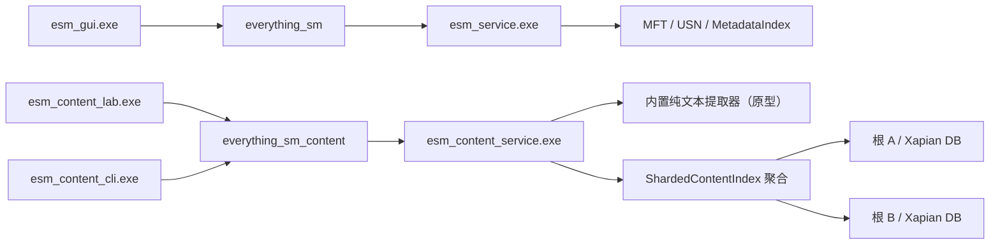

# 独立文件内容搜索原型

本文说明基于 Xapian 的文件内容搜索实验系统。它与现有文件名/元数据搜索完全分离，目的是在不影响 `esm_service.exe` 延迟、内存和稳定性的前提下，独立验证正文提取、全文索引、摘要和高亮。

> 当前是开发原型，不是正式 Windows 服务，也没有并入 NSIS 安装流程。不得把本文描述理解为已完整兼容 Everything 内容搜索或已经达到生产发布标准。

## 1. 进程边界



文件名搜索进程不链接 Xapian。即使内容服务停止、索引损坏或内容查询超时，现有 `esm_gui.exe` → `esm_service.exe` 文件名搜索链路也不受影响。功能成熟后计划只把内容搜索入口合并到主 GUI，后台内容服务仍保持独立进程。

## 2. 当前可执行程序

| 程序 | 作用 |
|---|---|
| `esm_content_service.exe` | 扫描一个或多个根目录、按根建立独立 Xapian 正文索引、监听目录变化并提供聚合查询 Named Pipe |
| `esm_content_lab.exe` | 独立 Win32 实验 UI，提供延迟查询、结果列表、摘要、匹配高亮和双击打开 |
| `esm_content_cli.exe` | 查询状态和执行真实 IPC 搜索，主要用于开发与诊断 |

GitHub Actions 会构建和测试这三个实验程序，但当前 portable ZIP 与 NSIS 安装包都不分发内容搜索二进制；完成 Xapian 许可证兼容和分发材料审查后再决定发布方式。

## 3. 构建依赖

仓库在 `third_party/xapian-core` 固定保存完整的 Xapian Core 1.4.31 官方发布源码，原始归档 SHA-256 为：

```text
FECF609EA2EFDC8A64BE369715AAC733336A11F7480A6545244964AE6BC80811
```

内容搜索必须用 `-DESM_BUILD_CONTENT_SEARCH=ON` 显式启用；启用后默认 `ESM_XAPIAN_PROVIDER=BUNDLED`。CMake 通过 MSYS2 Bash 调用上游 Autotools，只编译静态 `libxapian.a`，并关闭 chert、inmemory 和 remote 后端；内容数据库使用 glass 后端。构建不再依赖 MSYS2 的预编译 `xapian-core` 包。

MinGW64 开发机需要编译器、zlib 和基础 Unix 构建工具：

```powershell
C:\msys64\usr\bin\pacman.exe -S --needed --noconfirm `
  mingw-w64-x86_64-gcc mingw-w64-x86_64-cmake `
  mingw-w64-x86_64-zlib make diffutils gawk grep sed perl
```

构建：

```powershell
cmake -S . -B build-content -G "MinGW Makefiles" `
  -DCMAKE_BUILD_TYPE=Release `
  -DESM_BUILD_TESTS=ON `
  -DESM_BUILD_BENCHMARKS=OFF `
  -DESM_BUILD_CONTENT_SEARCH=ON `
  -DESM_XAPIAN_PROVIDER=BUNDLED `
  -DESM_XAPIAN_BUILD_JOBS=4
cmake --build build-content --parallel 4
ctest --test-dir build-content --output-on-failure
```

首次构建会在 `build-content/_deps/xapian-1.4.31-build` 配置并编译 Xapian，后续未改变 third-party 源码或配置时复用产物。需要临时使用工具链中已有的静态库时，可显式传入 `-DESM_XAPIAN_PROVIDER=SYSTEM`；该模式仍要求存在 `xapian.h` 和 `libxapian.a`。`BUNDLED` 源码路径目前只实现 MinGW 构建，其他编译器应使用 `SYSTEM`。

## 4. 启动与使用

先启动内容服务。单根模式继续支持直接指定一个数据库：

```powershell
.\build-content\esm_content_service.exe `
  --root D:\work `
  --db "$env:LOCALAPPDATA\everything_sm\content\xapian" `
  --pipe everything_sm_content `
  --max-mib 4
```

多根模式使用可重复的 `--root` 和数据库根目录：

```powershell
.\build-content\esm_content_service.exe `
  --root D:\work `
  --root E:\documents `
  --db-root "$env:LOCALAPPDATA\everything_sm\content" `
  --exclude D:\work\generated
```

整机固定卷模式必须显式选择，不会因为安装或普通启动而自动执行：

```powershell
.\build-content\esm_content_service.exe `
  --all-fixed `
  --db-root D:\everything-sm-content
```

`--all-fixed` 通过 Windows 固定卷发现加入当前可访问的 `DRIVE_FIXED` 盘符，也可与额外 `--root` 合并。重叠根会保留范围更大的根，避免重复索引。首次扫描在后台进行，Pipe 会立即接受 status 和对已提交批次的查询。

再启动实验 UI：

```powershell
.\build-content\esm_content_lab.exe
```

CLI 诊断：

```powershell
.\build-content\esm_content_cli.exe status
.\build-content\esm_content_cli.exe search Xapian 20
.\build-content\esm_content_cli.exe search 内容索引 20
```

如果使用自定义 Pipe，UI 的第一个命令行参数是 Pipe 名；CLI 使用 `--pipe <name>`。

## 5. 当前索引和查询行为

- 默认 Pipe：`everything_sm_content`。
- 单根默认数据库：`%PROGRAMDATA%\everything_sm\content\xapian`；单根可用 `--db` 保持直接数据库布局。
- 多根或整机固定卷模式使用 `--db-root`，每根数据库布局为 `<db-root>\volumes\<root-key>\xapian`；卷根 key 包含盘符和 volume serial，普通目录使用规范化路径哈希。
- `--root` 可重复；`--all-fixed` 是显式 opt-in，不会由安装程序或普通启动隐式触发。
- 每根目录拥有独立后台扫描线程和递归 `DirectoryWatcher`；全局查询分别查询各 Xapian shard，再按相关度和路径稳定合并。
- 初次扫描期间 Pipe 已可用；每 500 个文档提交一次批次，实时变化按通知批次提交。
- 默认排除卷根下的 `Windows`、`Program Files`、`Program Files (x86)`、`ProgramData`、`$Recycle.Bin`、`System Volume Information`、`Recovery`，以及任意层级的 `.git`、`.svn`、`node_modules`、`.cache`、`__pycache__`。可重复 `--exclude`；`--no-default-excludes` 只关闭默认规则，数据库目录始终自动排除以防自索引。
- 默认单文件上限 4 MiB；`--max-mib` 可设置为 1～64 MiB。
- Xapian QueryParser 默认 AND，启用 phrase、boolean、love/hate、wildcard 和 CJK n-gram。
- 搜索结果上限 500；实验 UI 当前请求 100 条。
- Xapian 文档 data 当前保存规范化路径和完整提取正文，用于生成摘要；这是原型设计，不是最终空间方案。
- 路径唯一键当前是规范化小写路径的 FNV-1a 64 位哈希，尚未统一为卷标识 + File ID。
- writer `commit()` 与查询只读快照通过共享/独占 revision 锁协调；多个查询可并行，commit 会等待当前查询结束。数据库 revision 变化时查询最多重新打开重试 3 次，Pipe、扫描/监听工作线程和进程入口会拦截不继承 `std::exception` 的 Xapian 异常，避免服务直接终止。

## 6. 支持的纯文本类型和编码

当前扩展名：

```text
.txt .md .log .csv .json .xml .yaml .yml .ini .cfg
.c .cc .cpp .cxx .h .hpp .cs .java .py .js .ts .tsx .jsx
.rs .go .cmake .ps1 .bat .cmd .sql .html .htm .css .toml
```

编码支持：

- UTF-8 和 UTF-8 BOM；
- UTF-16LE BOM；
- UTF-16BE BOM；
- 当前 Windows 本地 ANSI code page 回退。

前 4096 字节发现 NUL 时按二进制文件跳过。当前不支持 PDF、Office、压缩包、邮件、OCR、图片、音视频元数据或第三方 IFilter。

## 7. UI 摘要与高亮

`esm_content_lab.exe` 使用 180 ms debounce，在后台执行 Pipe 查询，并用 generation 丢弃过期响应。结果列包括：

- 名称；
- 路径；
- 内容匹配；
- 相关度。

摘要由 Xapian `MSet::snippet()` 生成，服务端把匹配区间转换为 UTF-16 code-unit 范围，UI 对“内容匹配”列自绘黄色/橙色背景。双击结果会使用 Shell 打开文件。

## 8. 已验证范围

2026-07-26 在本机 Release MinGW64 构建中完成以下验证：

- 内容协议 search/status 和 UTF-16 高亮范围 round-trip；
- UTF-8、UTF-16LE、二进制跳过、文件大小上限；
- Xapian 英文和中文 n-gram 查询；
- 摘要和高亮非空；
- upsert 替换旧正文；
- delete 后不再命中；
- 独立 Named Pipe 的 status/search 真实 E2E；
- 修改文件后 watcher 增量命中；
- 两个临时根的真实多根 Pipe E2E：两个 shard 均可命中、第二根 watcher 新增文件可命中、停止后重启可重新打开数据库；
- 两个临时根的分片路由、聚合查询、全局 limit、状态汇总和删除路由；
- 默认/自定义路径排除及数据库 root key 稳定性；
- 60 次 commit 与至少 120 次搜索交错的直接并发回归；
- 约 26.47 万文档、4.63 GiB 数据库在后台扫描期间连续真实 Pipe 查询后服务仍存活。

自动测试多数仍是小规模功能验证；真实数据库验证只证明本次并发崩溃已不再复现，不代表长期稳定性。真实性能数据见 [PERFORMANCE.md](PERFORMANCE.md)：当前 `limit=100` 查询可达 0.67～5.81 秒，不能评价为即时搜索。

## 9. 已知限制和下一阶段

- 还不是 SCM Windows Service，没有安装、自动启动、恢复和卸载策略。
- 启动扫描只 upsert；服务停止期间被删除的旧文档尚不会自动从已有数据库清除，各 shard 也没有周期性全量 reconciliation。
- watcher 通知溢出时只提示重启校准，不会自动 reconciliation。
- 扫描期间发生且未被 watcher 覆盖的窄时间窗变化仍需后续消除。
- 文本提取仍在内容服务进程内，恶意或异常文件的隔离 worker 尚未实现。
- 没有 ACL/per-request impersonation，服务不能按查询用户过滤不可访问文件。
- 固定盘多根发现已经可用，但没有网络共享、可移动卷、云盘 provider、动态卷热插拔管理和持久化任务队列。
- 完整正文存入 Xapian document data 会放大数据库；后续考虑压缩正文 sidecar，例如 `content-text.pack`。
- 实验 UI 的后台任务模型仍需改成可取消的长期 worker，并补充关闭窗口时的严格生命周期测试。
- 已有首个真实数据库查询范围，但尚无首次建库吞吐、规范的 warm/cold p50/p95、长期内存或真实 GUI 端到端基准；当前完整正文读取与逐结果摘要生成会让 `limit=100` 查询达到秒级。
- Xapian 使用 GPL 许可证；正式分发前必须完成许可证兼容性、源代码提供方式、NOTICE/许可证文本和安装包合规审查。

## 10. 合并策略

达到以下条件后再把入口并入主 GUI：

1. 内容数据库能够可靠校准和崩溃恢复；
2. 提取器有独立进程、超时、大小和资源限制；
3. 查询取消、并发、权限和 UI 生命周期有自动测试；
4. 内容索引的磁盘、内存、建库时间和查询延迟有真实基线；
5. Windows Service、配置、安装/卸载和升级策略完成；
6. Xapian 分发许可证方案完成审查。

即使入口合并，`esm_content_service.exe` 和内容数据库仍保持独立，不把 Xapian 链接进 `esm_service.exe`。