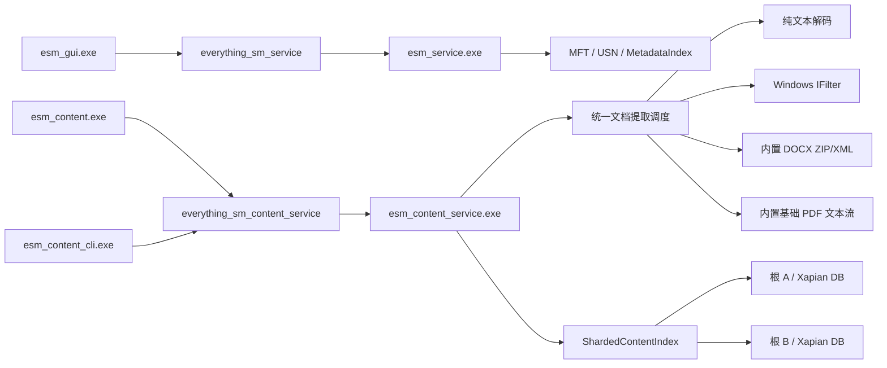

# 独立文件内容搜索应用

本文说明基于 Xapian 的独立文件内容搜索应用。它与文件名/元数据搜索保持进程、数据库、配置和 IPC 隔离，目标是在不增加 `esm_service.exe` 延迟、内存和故障面的前提下发展全文检索能力。

> 当前仍属于开发阶段。它不等于 Everything 内容搜索的完整兼容实现，也尚未达到公开发布标准。

## 1. 边界与进程



隔离原则：

- `esm_service.exe` 和 `esm_gui.exe` 不链接 Xapian；
- 内容服务使用独立 Named Pipe `everything_sm_content_service`；
- 内容配置和数据库默认位于 `%LOCALAPPDATA%\everything_sm_content`；
- 文件名搜索使用自己的 snapshot/WAL，两个系统不共享可写数据库；
- 内容服务停止、索引损坏或查询超时，不影响文件名搜索；
- 未来即使提供统一入口，底层服务和数据库仍保持隔离。

## 2. 可执行程序

| 程序 | 作用 |
|---|---|
| `esm_content.exe` | 独立 Win32 内容搜索入口；160 ms debounce、单一长期 IPC worker、过期响应丢弃、服务状态灯、Shell 文件图标、摘要高亮、按钮/右键菜单/快捷键；需要时会隐藏启动同目录下的内容服务 |
| `esm_content_service.exe` | 加载独立配置，扫描一个或多个根目录，按根建立 Xapian 分片，监听目录变化并提供聚合查询 Pipe |
| `esm_content_cli.exe` | 查询状态和执行真实 IPC 搜索，主要用于开发、诊断和自动化验证 |

旧名称 `esm_content_lab.exe` 已在 2026-07-29 被 `esm_content.exe` 替代，不再生成新的实验室目标。

## 3. 默认配置和数据目录

默认配置：

```text
%LOCALAPPDATA%\everything_sm_content\content.ini
```

默认数据库根：

```text
%LOCALAPPDATA%\everything_sm_content\index
```

默认 Pipe：

```text
everything_sm_content_service
```

首次直接启动 `esm_content.exe` 或不带根参数启动 `esm_content_service.exe` 时，如果默认配置不存在，程序会创建配置。默认只索引当前用户配置文件目录，不会自动扫描所有固定盘。

配置示例：

```ini
[content]
version=1
database_root=C:\Users\name\AppData\Local\everything_sm_content\index
pipe_name=everything_sm_content_service
maximum_bytes=4194304
all_fixed=0
use_default_excludes=1
root_count=1
root0=C:\Users\name
exclude_count=0
```

多根和排除目录使用连续编号：`root0`、`root1`、`exclude0`、`exclude1`。`maximum_bytes` 当前限制在 1 KiB 到 64 MiB。配置、数据库、Pipe 和进程均不复用文件名搜索的状态。

## 4. 构建

内容搜索必须显式启用：

```powershell
$env:PATH = 'C:\msys64\ucrt64\bin;' + $env:PATH
cmake -S . -B build-content -G Ninja `
  -DCMAKE_BUILD_TYPE=Release `
  -DESM_BUILD_CONTENT_SEARCH=ON `
  -DESM_BUILD_TESTS=ON `
  -DESM_BUILD_BENCHMARKS=OFF
cmake --build build-content --target `
  esm_content esm_content_service esm_content_cli esm_content_tests
ctest --test-dir build-content -R esm_content_tests --output-on-failure
```

仓库在 `third_party/xapian-core` 固定保存 Xapian Core 1.4.31 上游源码。默认 `ESM_XAPIAN_PROVIDER=BUNDLED` 会从源码生成静态库；`SYSTEM` 仅用于开发机已有 ABI 匹配 Xapian 的场景。

## 5. 启动与使用

最简单的使用方式：

```powershell
.\build-content\esm_content.exe
```

GUI 会读取默认配置，并在 Pipe 不可用时使用 `CREATE_NO_WINDOW` 启动同目录下的 `esm_content_service.exe`。内容服务有按 Pipe 命名的单实例互斥体，重复启动不会建立第二套相同 Pipe 的扫描任务。

使用指定配置：

```powershell
.\build-content\esm_content.exe --config D:\content-search\content.ini
```

直接启动服务：

```powershell
.\build-content\esm_content_service.exe `
  --config D:\content-search\content.ini
```

`--config` 指定的配置文件必须存在；服务和 CLI 会在文件缺失或 schema 版本不匹配时直接报错，避免静默连接到错误的 Pipe。GUI 使用默认配置路径时会在首次启动自动创建配置。

命令行参数仍可覆盖配置：

```powershell
.\build-content\esm_content_service.exe `
  --root D:\work `
  --root E:\documents `
  --db-root D:\content-index `
  --exclude D:\work\generated `
  --pipe content_test_pipe `
  --max-mib 4
```

显式整机固定盘索引：

```powershell
.\build-content\esm_content_service.exe `
  --all-fixed `
  --db-root D:\content-index
```

`--all-fixed` 会产生明显的首次扫描 CPU、磁盘读取和数据库写入负载；默认配置和开发安装包不会自动打开该选项。

CLI 示例：

```powershell
.\build-content\esm_content_cli.exe status
.\build-content\esm_content_cli.exe search "Xapian 数据库" 50
.\build-content\esm_content_cli.exe `
  --config D:\content-search\content.ini status
```

## 6. 当前索引格式

纯文本和源码白名单包括：

```text
.txt .md .log .csv .json .xml .yaml .yml .ini .cfg
.c .cc .cpp .cxx .h .hpp .cs .java .py .js .ts .tsx .jsx
.rs .go .cmake .ps1 .bat .cmd .sql .html .htm .css .toml
```

文档格式支持：

| 格式 | 提取路径 | 当前边界 |
|---|---|---|
| `.docx` | 先尝试 Windows IFilter；失败后使用内置 ZIP/Deflate + `word/document.xml` 提取器 | 支持正文 XML、实体、段落、换行和 Tab；不覆盖宏、嵌入对象、批注等完整 Office 语义 |
| `.pdf` | 先尝试 Windows IFilter；失败后使用内置基础 PDF 文本流提取器 | 仅面向未加密、可直接提取文本的基础 PDF；复杂字体 CMap、自定义字形、对象流和完整 PDF 标准不保证 |
| `.doc` | Windows IFilter | 本机没有对应 IFilter 时跳过；没有内置旧二进制 Word 解析器 |

纯文本支持 UTF-8、带 BOM 的 UTF-8、UTF-16LE、UTF-16BE，以及可转换的本地代码页文本。检测到二进制 NUL、文件或提取文本超过大小上限时跳过。扫描版 PDF、图片和其他无文本图像尚无 OCR；加密 PDF 不支持。

Windows IFilter 是环境相关的扩展路径；第三方 IFilter 当前直接运行在内容服务进程内，尚没有独立沙箱、超时或崩溃隔离。内置 DOCX/PDF 回退使自动测试和基础使用不依赖本机安装 Office 或 PDF 阅读器。

默认排除 Windows 系统目录、回收站、卷信息目录，以及 `.git`、`node_modules`、构建缓存等常见高噪声路径；可使用配置或 `--exclude` 增补。

## 7. 查询和 UI

- 英文使用 Xapian QueryParser，CJK 连续文本补充二元/三元 n-gram；
- Xapian 文档唯一键由规范化路径生成，upsert 替换旧正文，remove 删除对应文档；
- 多根模式先查询各 shard，再按相关度合并并执行全局 limit；
- 摘要由 Xapian 生成，服务端返回 UTF-16 高亮范围，GUI 在“内容匹配”列和右侧预览窗格绘制黄色/橙色高亮；
- 查询结果默认选中第一项；右侧预览窗格显示文件名、完整路径和索引摘要，可由顶部按钮、“查看 → 预览窗格”或 `Ctrl+Shift+P` 开关，关闭后结果列表扩展；
- 预览只消费当前搜索响应中的 `snippet + highlights`，不会重新读取或解析原始 PDF/DOCX；它不是 Windows Preview Handler 或页面级渲染器；
- 搜索框使用 160 ms 防抖；所有查询和状态轮询复用一个长期 `std::jthread` worker，新输入覆盖尚未开始的旧请求，generation 机制丢弃已经过期的响应；
- 状态灯以红/黄/绿表示不可用、启动/索引/查询中和就绪；状态区分别显示服务说明与结果数量；
- 结果显示 Shell 文件图标，支持双击或“打开”按钮打开，支持“打开所在目录”，右键可复制完整路径；
- `Ctrl+L` 聚焦并全选搜索框，`Esc` 清空，`Enter` 立即查询或打开当前选中结果；
- 窗口有最小尺寸，结果列会随窗口宽度调整。

初次扫描在后台执行。Pipe 会先开放，因此建库过程中可以查询已经提交的文档；尚未建立索引的文件暂时不会命中。

当前 Named Pipe 请求仍是同步调用，窗口关闭时最坏可能等待当前请求超时；后续应改为可取消的 overlapped I/O。GUI 防抖和过期响应丢弃改善的是客户端连续输入体验，不等于降低 Xapian 服务端查询耗时。

## 8. 独立开发安装包

本仓库提供独立的开发安装脚本：

```powershell
.\packaging\build-content-installer.ps1 `
  -BuildDirectory build-content `
  -SkipBuild `
  -AllowDevelopmentPackage
```

输出：

```text
dist\everything-sm-content-<version>-dev-setup.exe
```

安装包特点：

- 与文件名搜索安装包分开；
- 按当前用户安装到 `%LOCALAPPDATA%\Programs\Everything SM Content Search`；
- 不需要管理员权限；
- 首次配置默认索引当前用户目录；
- GUI 按需隐藏启动内容服务，不注册 SCM 服务；
- 卸载时可选择是否删除 `%LOCALAPPDATA%\everything_sm_content`；
- 不把任何内容二进制加入主文件名搜索安装包。

**该安装包仅供本地开发验证，不能作为公开发布包。** Xapian 为 GPL-2.0-or-later，静态链接二进制公开分发前必须完成项目整体许可证决策、对应源码提供方式、构建材料和许可证文本审查。构建脚本要求显式传入 `-AllowDevelopmentPackage`，用于防止误发布。

## 9. 2026-07-29 验证范围

已验证：

- `ContentAppSettings` 配置保存/加载 round-trip；
- 默认内容数据根与文件名搜索数据根隔离；
- 协议 search/status 和 UTF-16 高亮范围 round-trip；
- 纯文本编码、二进制和大小过滤，以及统一提取调度保持纯文本行为；
- 自生成 stored/deflate DOCX 的 ZIP/XML/实体提取和损坏文档诊断；
- 自生成基础 PDF 的文本流提取，以及 `.pdf`/`.doc`/`.docx` 白名单；
- Xapian 英文/CJK 查询、upsert、delete、摘要和高亮；
- 多 shard 路由、聚合 limit 和状态汇总；
- 并发 commit/search 回归；
- 正式目标 `esm_content.exe`、服务、CLI 和测试的 Release 构建；
- 临时单根目录上的真实服务/CLI E2E：TXT、DOCX、PDF 共 3 个文档完成提交，DOCX/PDF 唯一词均可命中；本机没有可用 Office/PDF IFilter，命中来自内置回退；
- Windows UI 自动化检查搜索框、按钮、结果列、状态灯、状态文字、结果计数、DOCX/PDF 摘要预览、默认首项选择、按钮/菜单/`Ctrl+Shift+P` 开关，以及清空后的占位状态；
- 独立 NSIS 开发安装包可成功编译。

这些验证不代表首次整机建库吞吐、长期稳定性、权限隔离或公开发布合规已经完成。

## 10. 已知限制和下一阶段

- 内容服务仍不是 SCM Windows Service；
- 服务停止期间发生的删除可能留下 stale 文档，尚无持久任务队列和周期性全量 reconciliation；
- watcher 通知溢出后仍需重启校准；
- 文本提取仍在内容服务进程内，尚无受限 extractor worker、超时和崩溃隔离；
- 尚无 ACL/per-request impersonation，多用户不能共享同一可写内容数据库；
- 暂无网络共享、可移动卷、云盘 provider 和卷热插拔管理；
- 完整正文存入 Xapian document data 会放大数据库；
- GUI 已复用单一长期 worker，但 Named Pipe I/O 尚不可取消，仍需补窗口销毁期间的严格取消测试；
- 右侧预览目前仅显示索引摘要；尚未接入 Windows Preview Handler、PDF 页面渲染、Word 排版、图片或 OCR 预览；
- 真实数据库查询在大 `limit` 下仍可能达到秒级，尚未达到“即时内容搜索”；
- DOCX/PDF 仅实现上述第一阶段路径；仍无 OCR、加密 PDF、完整复杂 PDF 字体映射、完整 Office 语义和内置旧 `.doc` 解析；
- 第三方 Windows IFilter 当前运行在内容服务进程内，尚无 extractor 沙箱、超时和崩溃隔离；
- GPL/source-distribution 审查未完成，开发安装包不得公开分发。

后续即使增加文件名搜索与内容搜索之间的只读跳转或文件发现 IPC，也不允许共享可写索引数据库，Xapian 也不进入 `esm_service.exe` 进程。
